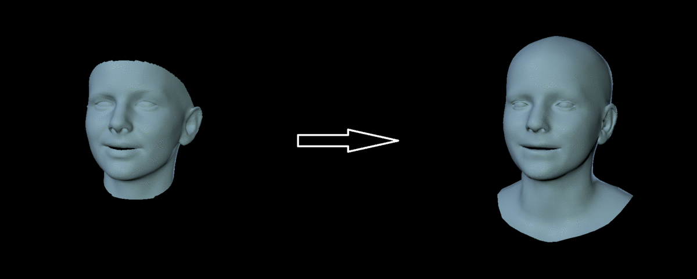

# Convert from Basel Face Model (BFM) to FLAME

This repository demonstrates 
1) how to create a [FLAME](http://flame.is.tue.mpg.de) texture model from the BFM vertex color space, and 
2) how to convert a BFM mesh to a FLAME mesh.

<p align="center"> 

</p>

<p align="center"> 

</p>

### About FLAME

FLAME is a lightweight and expressive generic head model learned from over 33,000 of accurately aligned 3D scans. For a list of public FLAME resources (publications, code repositories, datasets), please visit the [:fire: FLAME-Universe :fire:](https://github.com/TimoBolkart/FLAME-Universe).

### Setup

Install pip and virtualenv
```
sudo apt-get install python3-pip python3-venv
```

Clone the git project:
```
git clone https://github.com/TimoBolkart/BFM_to_FLAME.git
```

Set up and activate virtual environment:
```
mkdir <your_home_dir>/.virtualenvs
python3 -m venv <your_home_dir>/.virtualenvs/BFM_to_FLAME
source <your_home_dir>/.virtualenvs/BFM_to_FLAME/bin/activate
```

Make sure your pip version is up-to-date:
```
pip install -U pip
```

Install requirements
```
pip install numpy==1.19.4
pip install h5py==3.1.0
pip install chumpy==0.70 
pip install opencv-python==4.4.0.46
```

### Create texture model

Download BFM 2017 (i.e. 'model2017-1_bfm_nomouth.h5') from [here](https://faces.dmi.unibas.ch/bfm/bfm2017.html) and place it in the model folder.
Download inpainting masks from [here](http://files.is.tue.mpg.de/tbolkart/FLAME/mask_inpainting.npz) and place it in the data folder.

Running
```
python col_to_tex.py
```
outputs a 'FLAME_albedo_from_BFM.npz' in the output folder. This file can be used  with several FLAME-based repositories like [TF_FLAME](https://github.com/TimoBolkart/TF_FLAME) or [FLAME photometric optimization](https://github.com/HavenFeng/photometric_optimization).

### Convert meshes

Install mesh processing libraries from [MPI-IS/mesh](https://github.com/MPI-IS/mesh) within the virtual environment.
Download FLAME from [here](https://flame.is.tue.mpg.de) and place it in the model folder.

Running 
```
python mesh_convert.py
```
outputs a FLAME mesh for a specified BFM mesh. The demo supports meshes in 'BFM 2017', 'BFM 2009', or 'cropped BFM 2009' (i.e. as used by [3DDFA](http://www.cbsr.ia.ac.cn/users/xiangyuzhu/projects/3DDFA/main.htm)) topology.

### Citing

When using this code, the generated texture space, or FLAME meshes in a scientific publication, please cite 
```
@article{FLAME:SiggraphAsia2017,
  title = {Learning a model of facial shape and expression from {4D} scans},
  author = {Li, Tianye and Bolkart, Timo and Black, Michael. J. and Li, Hao and Romero, Javier},
  journal = {ACM Transactions on Graphics, (Proc. SIGGRAPH Asia)},
  volume = {36},
  number = {6},
  year = {2017},
  url = {https://doi.org/10.1145/3130800.3130813}
}
```

When using the converted texture space, please further follow the license agreement of the BFM model as specified [here](https://faces.dmi.unibas.ch/bfm/bfm2017.html). 

### Acknowledgement

We thank the authors of the BFM 2017 model for making the model publicly available. 
